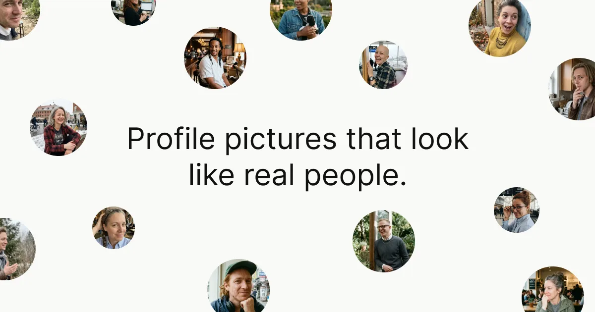
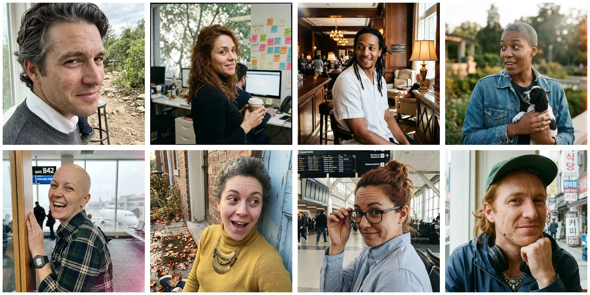

# Realistic Profile Pictures

Generate realistic AI profile pictures and avatars that **do not look AI-generated**. For filling mockups, websites, marketing, demos, and video with believable, diverse people, instead of uncanny AI output or the same recycled stock faces.



Every face below is generated. None of these people exist.



Packaged from [realpfp.vercel.app](https://realpfp.vercel.app) &middot; source: [heyimjames/RealPFP](https://github.com/heyimjames/RealPFP)

## Install

Works with Claude Code, Cursor, and any agent that supports [skills](https://www.npmjs.com/package/skills):

```bash
npx skills add heyimjames/realistic-profile-pictures
```

Then just ask for "realistic profile pictures", "avatars for a mockup", or "placeholder faces".

## Run it directly

Needs Node 18+ and a free [fal.ai key](https://fal.ai/dashboard/keys) (bring your own).

```bash
# preview prompts only, no API calls, no cost
node scripts/generate.mjs --count 3 --mode profile --dry-run

# generate images
FAL_KEY=your_key node scripts/generate.mjs --count 6 --mode profile --out ./faces
```

| Flag | Values |
| --- | --- |
| `--mode` | `aspirational` (polished), `profile` (natural), `candid` (documentary) |
| `--count` | 1 to 50 |
| `--resolution` | `1K`, `2K` |
| `--out` | output folder (default `./pfp-out`) |
| `--dry-run` | print prompts, generate nothing |

## Why the faces look real

The value is the prompt engine, not the API call. nano-banana-2 is a Gemini-family model, so it:

- **Describes what a real photo has** (pores, one light source, one catchlight, correct anatomy) instead of naming what to avoid. Saying "no plastic skin" can summon plastic skin.
- **Avoids beauty-filter trigger words** (flawless, perfect, radiant) that plasticise the result.
- **Varies everything** that AI tends to fix: body shape, teeth, eyes, hair, wardrobe, background.

More detail: [reference/prompt-principles.md](reference/prompt-principles.md).

## Notes

- Your fal.ai key is read from the environment for the API call only, never stored.
- Curate: models still slip occasionally, so generate a few extra and keep the best.
- Generates fictional people for design use, not impersonation or headshots of real people.

## License

[MIT](LICENSE) &copy; James Frewin
